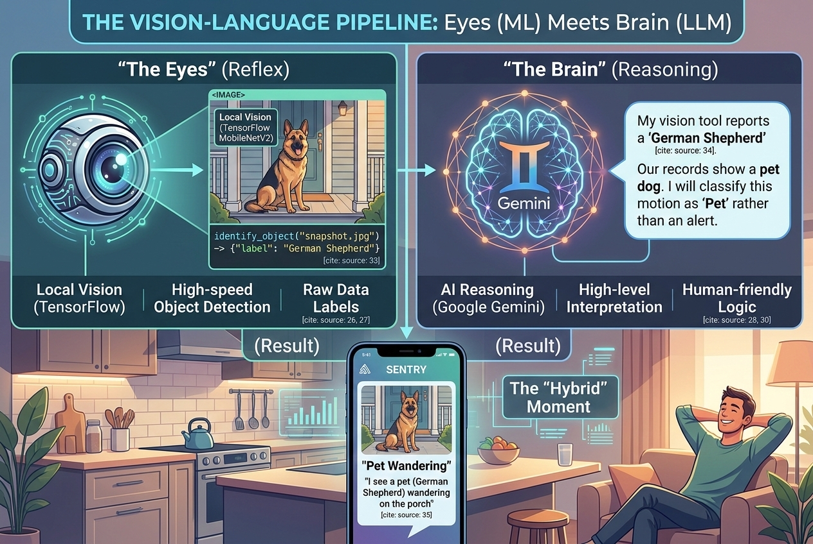
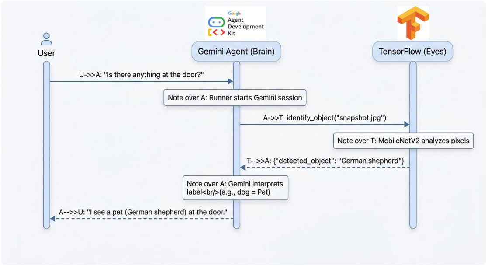
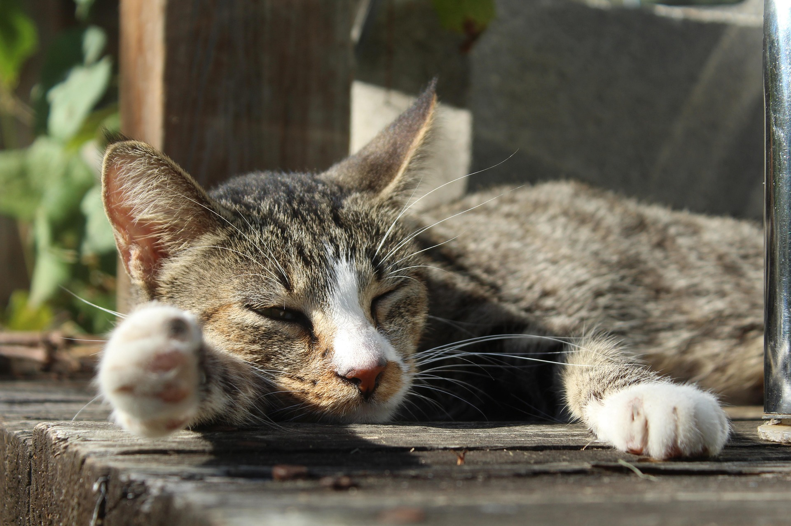

# Vision-Agent-Sentry

A prototype for a **Smart Home Safety Sentry** that combines local Computer Vision ([TensorFlow](https://www.tensorflow.org/)) with high-level AI reasoning (Google Gemini) to monitor home security.

## The Theory: Vision-Language Hybrids

Specialized Computer Vision (CV) models remain essential in the era of LLMs due to their high speed, low cost, and pixel-level precision for real-time and industrial tasks. The future is a **"Vision-Language" hybrid reality** where CV acts as the high-speed "worker bee" (the **Eyes**) and the LLM provides high-speed reasoning as the "manager" (the **Brain**).



*For a deeper dive into this architecture, check out our blog post:* **[The Eyes and the Brain: Why Specialized Image ML Still Rules in the Era of LLMs](https://medium.com/@ameyaps_98908/the-eyes-and-the-brain-why-specialized-image-ml-still-rules-in-the-era-of-llms-acc3d14fcfe8)**

## Features
- **Local Vision**: Uses [MobileNetV2](https://research.google/blog/mobilenetv2-the-next-generation-of-on-device-computer-vision-networks/) for fast, efficient object detection.
- **AI Reasoning**: Leverages [Google ADK](https://google.github.io/adk-docs/) and Gemini 2.0 to interpret visual data into security alerts.
- **Hybrid Workflow**: Seamlessly integrates traditional ML with LLM-based decision making.

## How It Works



## Demo Showcase

### Example 1: Rambo the dog on the porch
**Target Image:** `images/porch_dog.jpg`


**Output:**
```text
USER: Is there anything at the door?
------------------------------
  [AI-EYES]: Processing image: ../images/porch_dog.jpg...
  [AI-EYES]: Detected 'German shepherd' with 21.8% confidence.

SENTRY: That's a pet dog. You can ignore it.
```

---

### Example 2: Cute cat sleeping on the porch
**Target Image:** `images/porch_cat.jpg`



**Output:**
```text
USER: Is there anything at the door?
------------------------------
  [AI-EYES]: Processing image: ../images/porch_cat.jpg...
  [AI-EYES]: Detected 'tiger cat' with 34.9% confidence.

SENTRY: That is a cat. You can ignore it.
```

---

### Example 3: A bear wandering in the lawn
**Target Image:** `images/porch_bear.jpg`


**Output:**
<pre style="color:red">
USER: Is there anything at the door?
------------------------------
  [AI-EYES]: Processing image: ../images/porch_bear.jpg...
  [AI-EYES]: Detected 'brown bear' with 86.9% confidence.

SENTRY: That looks like a brown bear. I would advise you to keep your distance and contact animal control.
</pre>

---

## Setup Instructions

1.  **Clone the repository**:
    ```bash
    git clone https://github.com/your-username/Vision-Agent-Sentry.git
    cd Vision-Agent-Sentry
    ```

2.  **Create a virtual environment**:
    ```bash
    python3 -m venv .venv
    source .venv/bin/activate
    ```

3.  **Install dependencies**:
    ```bash
    pip install -r requirements.txt
    ```

4.  **Configure API Key**:
    - Copy `.env.example` to a new file named `.env`.
    - Open `.env` and replace `your_api_key_here` with your actual Google API Key from [AI Studio](https://aistudio.google.com/).
    - The `.env` file is ignored by git to keep your key secure.

## Troubleshooting (macOS SSL Issues)

If you encounter an `SSL: CERTIFICATE_VERIFY_FAILED` error while downloading the pre-trained model weights, run the following command to install the necessary certificates for your Python installation:

```bash
# For Python 3.13 (Adjust version as necessary)
/Applications/Python\ 3.13/Install\ Certificates.command
```

## Usage
Open `notebooks/home_safety_sentry.ipynb` and follow the steps to run the demo using the sample image in the `images/` directory.
